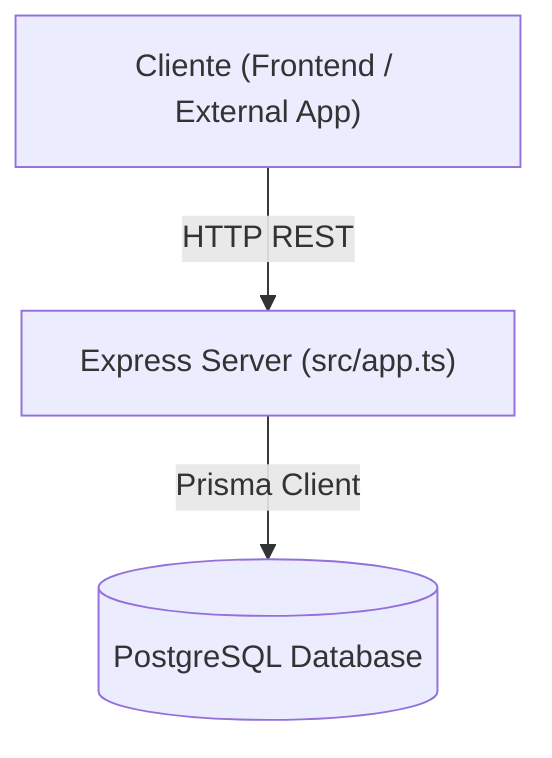

# Arquitectura del Backend — Callvu Agenda API

Este documento describe la arquitectura y estructura del servicio **Backend autónomo** de **Callvu Agenda**.

---

## 1. Vista General

El proyecto es una **API REST independiente** desarrollada con Node.js, Express, TypeScript y Prisma ORM.



---

## 2. Estructura del Proyecto

```text
callvu-agenda-api/
├── prisma/
│   └── schema.prisma         # Esquema de datos PostgreSQL
├── src/
│   ├── types/                # Contratos y tipos de dominio
│   │   └── index.ts
│   ├── app.ts                # Configuración de Express (middlewares, rutas)
│   ├── app.test.ts           # Pruebas de integración de endpoints
│   └── server.ts             # Punto de entrada HTTP (puerto)
├── .gitignore
├── ARCHITECTURE.md
├── package.json              # Dependencias y scripts del backend
├── tsconfig.json             # Configuración del compilador TypeScript
└── vitest.config.ts          # Configuración del ejecutor de tests
```

---

## 3. Principios de Arquitectura

1. **Separación de Responsabilidades**: Repositorio 100% enfocado en la lógica del negocio de agendas, disponibilidad y turnos.
2. **Modelo Dominios e Interfaces**: Definición explícita de modelos (`Cliente`, `Agenda`, `Turno`, `Slot`) en `src/types/`.
3. **Persistencia con Prisma**: Modelado declarativo con PostgreSQL para garantizar integridad referencial y migraciones seguras.
4. **Testing Automatizado**: Pruebas con Vitest + Supertest para asegurar la estabilidad del servidor.

---

## 4. Guía de Comandos

| Comando | Descripción |
|---------|-------------|
| `npm run dev` | Inicia el servidor de desarrollo con recarga automática |
| `npm run build` | Compila TypeScript a código JavaScript en `dist/` |
| `npm run start` | Ejecuta la API compilada en producción |
| `npm run test` | Ejecuta la suite de pruebas unitarias/integración con Vitest |
| `npm run prisma:generate` | Genera el cliente de Prisma basado en el esquema |
| `npm run prisma:migrate` | Ejecuta migraciones de base de datos |
