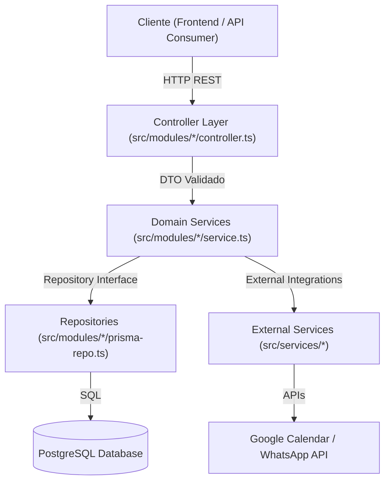

# Arquitectura del Backend — Callvu Agenda API

Este documento describe la arquitectura y estructura del servicio **Backend autónomo** de **Callvu Agenda**.

---

## 1. Vista General

El proyecto es una **API REST independiente** desarrollada con Node.js, Express, TypeScript, Zod y Prisma ORM.



---

## 2. Estructura del Proyecto

```text
callvu-agenda-api/
├── prisma/
│   └── schema.prisma                # Esquema declarativo de datos PostgreSQL
├── src/
│   ├── modules/                     # Módulos del Dominio del Negocio
│   │   ├── agenda/                  # Módulo de Agendas y Horarios de Atención
│   │   ├── cliente/                 # Módulo de Clientes (Directorio y WhatsApp)
│   │   ├── slot/                    # Algoritmo dinámico de cálculo de disponibilidad
│   │   └── turno/                   # Módulo de Turnos y Gestión de Reservas
│   ├── services/                    # Capa de Servicios e Integraciones Externas
│   │   ├── calendar/                # Integración con Google Calendar API (v3)
│   │   └── whatsapp/                # Integración con WhatsApp Business API (próximo)
│   ├── shared/                      # Infraestructura y Middlewares compartidos
│   │   ├── errors/                  # Jerarquía de clases de error (AppError, etc.)
│   │   ├── logger/                  # Logger estructurado
│   │   ├── middlewares/             # Middleware de validación Zod y error handler
│   │   └── swagger/                 # Definición y UI de Swagger/OpenAPI
│   ├── config/                      # Configuración de entorno (.env)
│   ├── types/                       # Contratos y tipos de dominio
│   ├── app.ts                       # Entrada de Express e Inyección de Dependencias
│   └── server.ts                    # Servidor HTTP (Puerto 3000)
├── openspec/                        # Especificaciones y diseños del flujo SDD
├── package.json                     # Dependencias y scripts
├── tsconfig.json                    # Configuración del compilador TypeScript
└── vitest.config.ts                 # Configuración de pruebas automatizadas
```

---

## 3. Principios Arquitectónicos

1. **Desacoplamiento de Módulos vs Servicios Externos**:
   - `src/modules/`: Contiene los módulos del dominio (`agenda`, `cliente`, `slot`, `turno`) siguiendo el patrón **Controller / Service / Repository**.
   - `src/services/`: Contiene la capa de **Servicios de Integración Externa** (Google Calendar, WhatsApp API, notificaciones).
2. **Validación en Runtime**: Esquemas de **Zod** para filtrar payloads en el Controller antes de invocar la lógica de negocio.
3. **Persistencia con Prisma**: Modelos aislados detrás de interfaces `IRepository`.
4. **Desarrollo TDD**: Cobertura de pruebas unitarias e integración en la capa de Services con Vitest + Supertest.

---

## 4. Guía de Comandos

| Comando | Descripción |
|---------|-------------|
| `pnpm dev` | Inicia el servidor de desarrollo en `http://localhost:3000` |
| `pnpm build` | Compila TypeScript a código JavaScript en `dist/` |
| `pnpm start` | Ejecuta la API compilada en producción |
| `pnpm test` | Ejecuta la suite completa de pruebas TDD con Vitest |
| `pnpm prisma:generate` | Genera el cliente de Prisma basado en el esquema |
| `pnpm prisma:migrate` | Ejecuta migraciones de base de datos |
