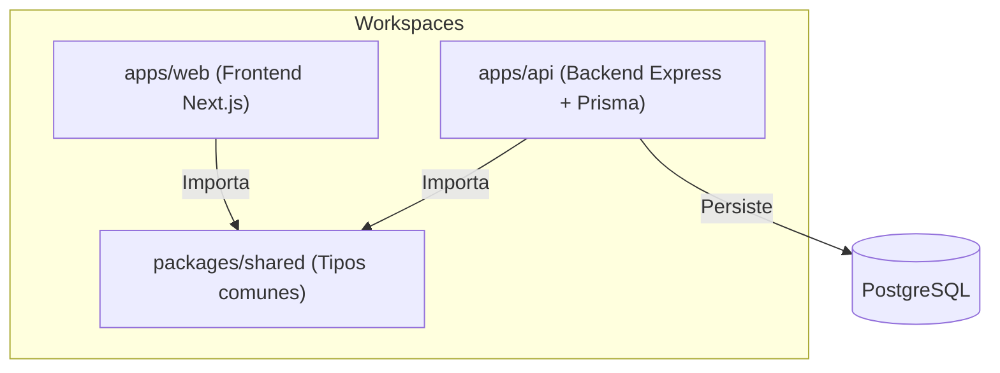

# Arquitectura del Proyecto — Callvu Agenda

Este documento describe la arquitectura, la estructura de directorios y la configuración de herramientas del monorepo de **Callvu Agenda**.

---

## 1. Vista General de la Arquitectura

El proyecto está organizado como un **monorepo TypeScript** gestionado por `pnpm` y orquestado por `Turborepo`. Esto permite compartir código entre el frontend y el backend de forma instantánea y segura.



---

## 2. Estructura del Proyecto

La raíz del monorepo distribuye las responsabilidades en las siguientes carpetas:

```text
callvu-agenda/
├── apps/
│   ├── api/                  # Servidor Backend (Express + Prisma)
│   └── web/                  # Cliente Frontend (Next.js App Router)
├── packages/
│   └── shared/               # Tipos, contratos e interfaces compartidas
├── openspec/                 # Especificaciones y diseños del flujo SDD
├── package.json              # Configuración raíz de Turborepo y scripts
├── pnpm-workspace.yaml       # Definición de workspaces de pnpm
└── turbo.json                # Pipeline de ejecución de tareas (build, test)
```

---

## 3. Workspaces en Detalle

### A. `@callvu-agenda/shared`
* **Ubicación**: `packages/shared/`
* **Propósito**: Contiene los contratos de datos y tipos de dominio compartidos por la API y la Web.
* **Modelos Principales**:
  * `Cliente`: Datos del usuario/operador.
  * `Agenda`: Horarios y reglas de slots disponibles.
  * `Turno`: Reservas concretas ligadas a una agenda y cliente.
  * `Slot`: Bloques dinámicos de tiempo calculado.

### B. `@callvu-agenda/api` (Backend)
* **Ubicación**: `apps/api/`
* **Tecnologías**: Node.js, Express, TypeScript, Prisma ORM.
* **Base de Datos**: PostgreSQL.
* **Diseño**: Modular. Los servicios y rutas se dividen en módulos (agenda, turno, slot, cliente) facilitando una migración futura a NestJS.
* **Testing**: Vitest + Supertest para llamadas HTTP directas al servidor Express.

### C. `@callvu-agenda/web` (Frontend)
* **Ubicación**: `apps/web/`
* **Tecnologías**: Next.js (App Router), React, TypeScript.
* **Estilos**: **CSS Modules (Vanilla CSS)** para encapsular el diseño con variables HSL globales. Sin librerías utilitarias pesadas.
* **Manejo de Estado**: **React Context API** nativa (`src/context/AppContext.tsx`) para la propagación de estados de usuario y configuraciones locales.
* **Testing**: Vitest + JSDOM + React Testing Library (RTL).

---

## 4. Orquestación y Herramientas (Turborepo)

Configuramos `turbo.json` en la raíz para definir cómo se ejecutan e interconectan las tareas:

* **Compilación (`pnpm build`)**: Sabe que `@callvu-agenda/api` y `@callvu-agenda/web` dependen de `@callvu-agenda/shared`. Compila primero el paquete compartido para evitar fallos de importación.
* **Testing (`pnpm test`)**: Ejecuta Vitest en todos los paquetes en paralelo.
* **Caché de Tareas**: Si corrés comandos sin haber modificado archivos, Turborepo te devolverá el resultado anterior instantáneamente (en milisegundos) leyendo el caché del disco.

> [!IMPORTANT]
> **Optimización de RAM para Entornos Virtuales**:
> Para evitar errores de falta de memoria (Out of Memory) en servidores de CI o contenedores virtuales, la suite de tests en `apps/web/vitest.config.ts` está configurada con `pool: 'forks'` y `singleFork: true`, ejecutando las simulaciones del navegador secuencialmente en un único proceso.

---

## 5. Guía de Comandos Rápidos

Ejecutá los siguientes comandos desde la **raíz del monorepo**:

| Comando | Acción |
|---------|--------|
| `pnpm install` | Instala todas las dependencias del monorepo |
| `pnpm build` | Compila todos los proyectos en orden de dependencia |
| `pnpm test` | Ejecuta las pruebas unitarias e integración en todos los workspaces |
| `pnpm --filter @callvu-agenda/api dev` | Levanta el backend Express en modo desarrollo (puerto 3000) |
| `pnpm --filter @callvu-agenda/web dev` | Levanta el frontend Next.js en modo desarrollo (puerto 3000/3001) |
