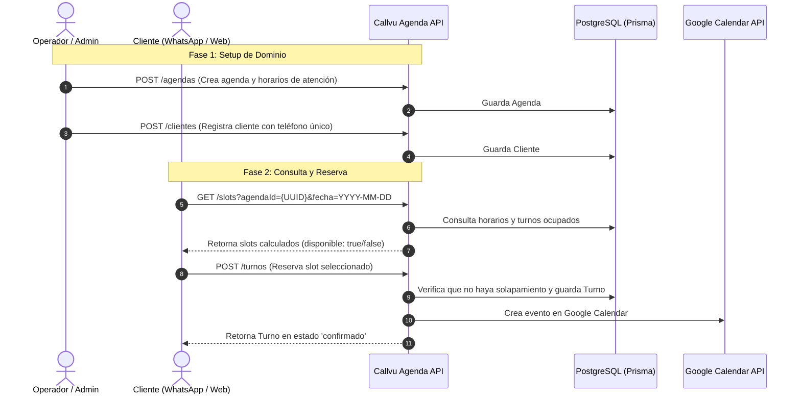

# Guía Paso a Paso de Prueba Manual e Integración — Callvu Agenda API

> Guía exhaustiva para configurar, probar manualmente con payloads JSON reales e integrar la API con WhatsApp Cloud API (Meta) y Google Calendar.

---

## 1. Flujo Completo del Sistema

El flujo de interacción del motor de turnos sigue una secuencia lógica desde la configuración inicial hasta la reserva del cliente:



---

## 2. Paso a Paso de Configuración Inicial

### Paso 1: Configuración de Base de Datos Local
1. Asegurate de tener **Docker Desktop** iniciado en tu computadora.
2. Abre la terminal en la raíz del proyecto y ejecuta:
   ```bash
   # 1. Copiar archivo de entorno
   cp .env.example .env

   # 2. Levantar el contenedor de PostgreSQL
   docker compose up -d

   # 3. Aplicar las migraciones de Prisma
   pnpm prisma:migrate

   # 4. Iniciar el servidor API
   pnpm dev
   ```

3. Verifica que la consola indique:
   - 🚀 Servidor ejecutándose en `http://localhost:3000`
   - 📚 Documentación Swagger UI en `http://localhost:3000/docs`

---

## 3. Payloads y Objetos de Prueba Manual

Podés ejecutar estas peticiones directamente en **Swagger UI (`http://localhost:3000/docs`)**, **Postman** o utilizando **cURL** en la terminal.

### 📌 Objeto 1: Crear una Agenda (`POST /agendas`)

Crea la configuración de una agenda médica/profesional con horarios de atención (Lunes de 09:00 a 17:00).

```bash
curl -X POST http://localhost:3000/agendas \
  -H "Content-Type: application/json" \
  -d '{
    "nombre": "Consulta Odontológica General",
    "descripcion": "Atención presencial en consultorio 102",
    "duracionSlot": 30,
    "activa": true,
    "horariosAtencion": [
      {
        "diaSemana": 1,
        "horaInicio": "09:00",
        "horaFin": "17:00"
      }
    ]
  }'
```

**Respuesta Esperada (201 Created):**
```json
{
  "id": "123e4567-e89b-12d3-a456-426614174000",
  "nombre": "Consulta Odontológica General",
  "descripcion": "Atención presencial en consultorio 102",
  "duracionSlot": 30,
  "activa": true,
  "horariosAtencion": [
    {
      "diaSemana": 1,
      "horaInicio": "09:00",
      "horaFin": "17:00"
    }
  ],
  "createdAt": "2026-07-30T17:00:00.000Z"
}
```
> 💡 *Guarda el `id` retornado (UUID) para las siguientes peticiones.*

---

### 📌 Objeto 2: Registrar un Cliente (`POST /clientes`)

Registra el perfil del cliente que reservará los turnos.

```bash
curl -X POST http://localhost:3000/clientes \
  -H "Content-Type: application/json" \
  -d '{
    "nombre": "Mariana López",
    "telefono": "+5491133334444",
    "email": "mariana.lopez@example.com"
  }'
```

**Respuesta Esperada (201 Created):**
```json
{
  "id": "987e6543-e89b-12d3-a456-426614174999",
  "nombre": "Mariana López",
  "telefono": "+5491133334444",
  "email": "mariana.lopez@example.com",
  "createdAt": "2026-07-30T17:05:00.000Z"
}
```
> 💡 *Guarda el `id` del cliente.*

---

### 📌 Objeto 3: Consultar Slots Disponibles (`GET /slots`)

Calcula los bloques de tiempo libres para el Lunes `2026-08-03` (Lunes = diaSemana 1).

```bash
curl -X GET "http://localhost:3000/slots?agendaId=123e4567-e89b-12d3-a456-426614174000&fecha=2026-08-03"
```

**Respuesta Esperada (200 OK):**
```json
[
  {
    "fechaHora": "2026-08-03T09:00:00.000Z",
    "disponible": true,
    "agendaId": "123e4567-e89b-12d3-a456-426614174000"
  },
  {
    "fechaHora": "2026-08-03T09:30:00.000Z",
    "disponible": true,
    "agendaId": "123e4567-e89b-12d3-a456-426614174000"
  },
  {
    "fechaHora": "2026-08-03T10:00:00.000Z",
    "disponible": true,
    "agendaId": "123e4567-e89b-12d3-a456-426614174000"
  }
]
```

---

### 📌 Objeto 4: Reservar un Turno (`POST /turnos`)

Reserva el slot disponible de las 09:30:00.

```bash
curl -X POST http://localhost:3000/turnos \
  -H "Content-Type: application/json" \
  -d '{
    "agendaId": "123e4567-e89b-12d3-a456-426614174000",
    "clienteId": "987e6543-e89b-12d3-a456-426614174999",
    "fechaHora": "2026-08-03T09:30:00.000Z"
  }'
```

**Respuesta Esperada (201 Created):**
```json
{
  "id": "555e4567-e89b-12d3-a456-426614174555",
  "agendaId": "123e4567-e89b-12d3-a456-426614174000",
  "clienteId": "987e6543-e89b-12d3-a456-426614174999",
  "fechaHora": "2026-08-03T09:30:00.000Z",
  "duracion": 30,
  "estado": "confirmado",
  "createdAt": "2026-07-30T17:10:00.000Z"
}
```

> ⚠️ **Prueba de Solapamiento**: Si vuelves a intentar hacer la misma reserva a las `09:30:00`, la API responderá automáticamente `400 Bad Request` indicando que el horario ya se encuentra reservado.

---

### 📌 Objeto 5: Simular Evento Webhook de WhatsApp (`POST /webhooks/whatsapp`)

Simula un mensaje entrante de un cliente enviado desde WhatsApp a la API:

```bash
curl -X POST http://localhost:3000/webhooks/whatsapp \
  -H "Content-Type: application/json" \
  -d '{
    "object": "whatsapp_business_account",
    "entry": [
      {
        "id": "WHATSAPP_ACCOUNT_ID",
        "changes": [
          {
            "value": {
              "messaging_product": "whatsapp",
              "metadata": {
                "display_phone_number": "15550252157",
                "phone_number_id": "100609346387085"
              },
              "messages": [
                {
                  "from": "5491133334444",
                  "id": "wamid.HBgLNTQ5MTEzMzMzNDQ0NBYA",
                  "timestamp": "1722360000",
                  "text": {
                    "body": "Hola, quisiera consultar los slots para el lunes"
                  },
                  "type": "text"
                }
              ]
            },
            "field": "messages"
          }
        ]
      }
    ]
  }'
```

**Respuesta Esperada (200 OK):**
```json
{
  "status": "EVENT_RECEIVED"
}
```

---

## 4. Guía de Conexión Real con WhatsApp (Meta Cloud API)

Para vincular mensajes de WhatsApp reales de tu teléfono con esta API:

### 1. Iniciar túnel Ngrok local
En una terminal secundaria:
```bash
npx ngrok http 3000
```
Copia la URL segura generada (ejemplo: `https://a1b2c3d4.ngrok-free.app`).

### 2. Registrar App en Meta Developers
1. Ve a [developers.facebook.com](https://developers.facebook.com/) y crea una App tipo **Business**.
2. Añade el producto **WhatsApp**.
3. En la sección **Configuración de WhatsApp ➔ Configuración**:
   - **URL de devolución de llamada**: `https://a1b2c3d4.ngrok-free.app/webhooks/whatsapp`
   - **Token de verificación**: `callvu_secret_verify_token_2026`
4. Haz clic en **Verificar y guardar**.

¡Listo! Tu API responderá automáticamente el handshake y quedará lista para procesar turnos vía WhatsApp.
