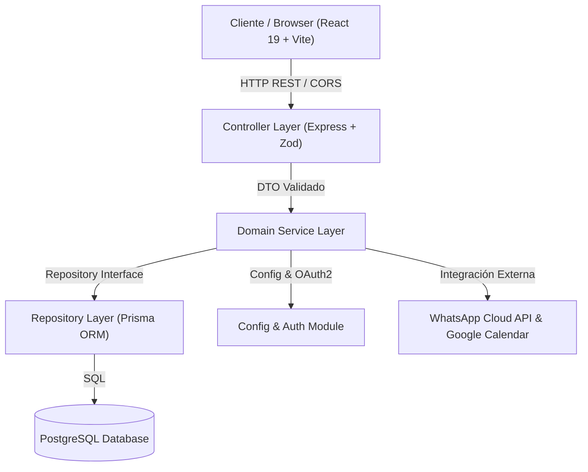

# Callvu Agenda — Plataforma Inteligente de Reserva de Turnos & API REST

> Solución omnicanal full-stack para el agendamiento de citas, sincronización con Google Calendar, confirmaciones por WhatsApp y panel de administración operativo.

---

## 1. Visión y Arquitectura del Sistema

**Callvu Agenda** se compone de una arquitectura full-stack moderna y desacoplada:

1. **Backend REST API (`src/`)**: Estructurado en **3 capas** (Controller / Service / Repository) complementado con una **capa de Servicios Externos**:
   - **Controller**: Maneja peticiones HTTP y valida DTOs en runtime con **Zod**.
   - **Service**: Reglas del dominio (slots, reservas, calendarios). Desarrollado mediante **Test-Driven Development (TDD)**.
   - **Repository**: Abstracción de persistencia con **Prisma ORM** y **PostgreSQL**.
   - **Services Layer**: Conectores para **Google Calendar API (v3)** y **WhatsApp Business Cloud API (Meta)**.
   - **Config & Auth**: Módulo de administración de credenciales y autorización OAuth2.

2. **Frontend SPA (`frontend/`)**: Construido con **React 19**, **Vite**, **TypeScript** y **Vanilla CSS** con sistema de tokens de diseño glassmorphic:
   - **Home Landing Page (`/`)**: Presentación del producto, misión y propósito, características 24/7, simuladores y centro de preguntas frecuentes.
   - **Portal de Reserva Cliente (`/reservar`)**: Formulario interactivo en 3 pasos para elegir servicio, horario y confirmar datos.
   - **Portal Admin (`/admin`)**: Protegido con pantalla de **Login** (`admin@callvu.com` / `admin1234`) y pestañas para gestionar Agendas, Clientes, Turnos, Bot de WhatsApp y **Configuración de Credenciales**.



---

## 2. Tech Stack

| Capa | Tecnología | Propósito |
|------|-----------|-----------|
| **Frontend** | React 19, Vite, TypeScript | SPA de alta velocidad con diseño Glassmorphism |
| **Estilos UI** | Vanilla CSS (CSS Variables) | Tokens personalizados de color, gradientes y animaciones |
| **Ruteo UI** | React Router DOM v7 | Ruteo cliente para Landing (`/`), Reservas (`/reservar`) y Admin (`/admin`) |
| **Backend Runtime** | Node.js (v20+ LTS) | Entorno de ejecución de servidor |
| **Web Framework** | Express (v4) | Servidor HTTP REST API |
| **Validación & DTOs** | Zod | Esquemas estricto en runtime |
| **ORM & DB** | Prisma ORM & PostgreSQL | Persistencia relacional de datos en contenedor Docker |
| **Integraciones** | Google APIs (`googleapis`) & Meta Cloud API | Sync de eventos en Google Calendar y notificaciones por WhatsApp |
| **Testing** | Vitest + Supertest | Suite de 39 pruebas unitarias e integración TDD |
| **Documentación** | Swagger UI (`swagger-ui-express`) | OpenAPI 3.0 interactivo en `/docs` |

---

## 3. Estructura del Proyecto

```text
Callvu_Agenda/
├── frontend/                        # Aplicación Frontend React + Vite
│   ├── src/
│   │   ├── components/
│   │   │   ├── LoginView.tsx        # Pantalla de Login Admin con credenciales demo
│   │   │   ├── ConfiguracionIntegracionesView.tsx # Panel de llaves API y OAuth
│   │   │   ├── FaqView.tsx          # Acordeón de Preguntas Frecuentes
│   │   │   ├── ReservaTurnoForm.tsx # Formulario de reserva cliente en pasos
│   │   │   └── ...                  # Vistas de Agendas, Clientes, Turnos y Bot
│   │   ├── pages/
│   │   │   ├── HomePage.tsx         # Landing Page principal (Agenda Intuitiva)
│   │   │   ├── ClientPage.tsx       # Vista cliente de agendamiento
│   │   │   └── AdminPage.tsx        # Vista administrativa protegida
│   │   ├── services/api.ts          # Cliente API HTTP con soporte offline / mock
│   │   └── index.css                # Sistema de tokens CSS, gradientes y utilidades
├── prisma/
│   └── schema.prisma                # Modelos de Base de Datos PostgreSQL
├── src/
│   ├── modules/                     # Módulos del Backend
│   │   ├── agenda/                  # Módulo de Agendas y Horarios
│   │   ├── cliente/                 # Módulo de Clientes
│   │   ├── slot/                    # Cálculo de disponibilidad de turnos
│   │   ├── turno/                   # Módulo de Turnos y Reservas
│   │   └── config/                  # Módulo de Credenciales, Configuración y OAuth2
│   ├── services/                    # Conectores Externos (Google Calendar & WhatsApp)
│   ├── shared/                      # Middlewares, Swagger y Manejo de Errores
│   ├── app.ts                       # Ensamblado de Express e Inyección de Dependencias
│   └── server.ts                    # Servidor HTTP (Puerto 3000)
├── docker-compose.yml               # PostgreSQL Docker setup
├── MANUAL_TESTING_GUIDE.md          # Guía de prueba manual y WhatsApp Webhook
├── package.json                     # Scripts del proyecto
└── README.md                        # Documentación oficial
```

---

## 4. Guía de Inicio Rápido (Local Setup)

### Requisitos Previos
- Node.js v20+ y pnpm (`npm i -g pnpm`)
- Docker Desktop activo

### Pasos para iniciar el Backend y la Base de Datos

```bash
# 1. Instalar dependencias del proyecto raíz y frontend
pnpm install
cd frontend && pnpm install && cd ..

# 2. Copiar variables de entorno
cp .env.example .env

# 3. Levantar contenedor de PostgreSQL
docker compose up -d

# 4. Generar cliente y aplicar migraciones de Prisma
pnpm prisma:generate
pnpm prisma:migrate

# 5. Ejecutar suite de pruebas TDD
pnpm test

# 6. Iniciar servidor Backend Express (Puerto 3000)
pnpm dev
```

### Pasos para iniciar el Frontend (React + Vite)

En una nueva terminal:

```bash
# Iniciar servidor de desarrollo del Frontend (Puerto 5173)
pnpm frontend
```

- **Landing Page (Home)**: `http://localhost:5173`
- **Portal Cliente (Reservar Turno)**: `http://localhost:5173/reservar`
- **Portal Administrador**: `http://localhost:5173/admin`
  - **Credenciales Demo**: `admin@callvu.com` / `admin1234`
- **Documentación Swagger OpenAPI**: `http://localhost:3000/docs`

---

## 5. Credenciales e Integraciones

### Acceso Administrador Demo
Para ingresar al panel administrativo en `http://localhost:5173/admin`:
- **Usuario**: `admin@callvu.com`
- **Contraseña**: `admin1234`
*(Podés usar el botón **Autocompletar ⚡** directamente en la pantalla de Login)*.

### Configuración de WhatsApp Cloud API & Google Calendar
Desde la pestaña **"Configuración & Credenciales"** en el panel Admin podés administrar:
1. **Google Calendar API**: Ingresar `Client ID`, `Client Secret` y presionar **"Vincular Google Account"** para iniciar el flujo de OAuth 2.0.
2. **WhatsApp Business API**: Ingresar `Phone Number ID`, `Access Token` y `Verify Token` para la recepción y envío de mensajes automatizados.

---

## 6. Guía de Prueba Manual & Webhooks

Para consultar el **diagrama de flujo de secuencia**, obtener los **objetos JSON y comandos cURL de prueba** y seguir la **guía de vinculación con Ngrok para WhatsApp Webhook**:

👉 **[MANUAL_TESTING_GUIDE.md](file:///C:/Users/moca_/OneDrive/Escritorio/Callvu_Agenda/MANUAL_TESTING_GUIDE.md)**
