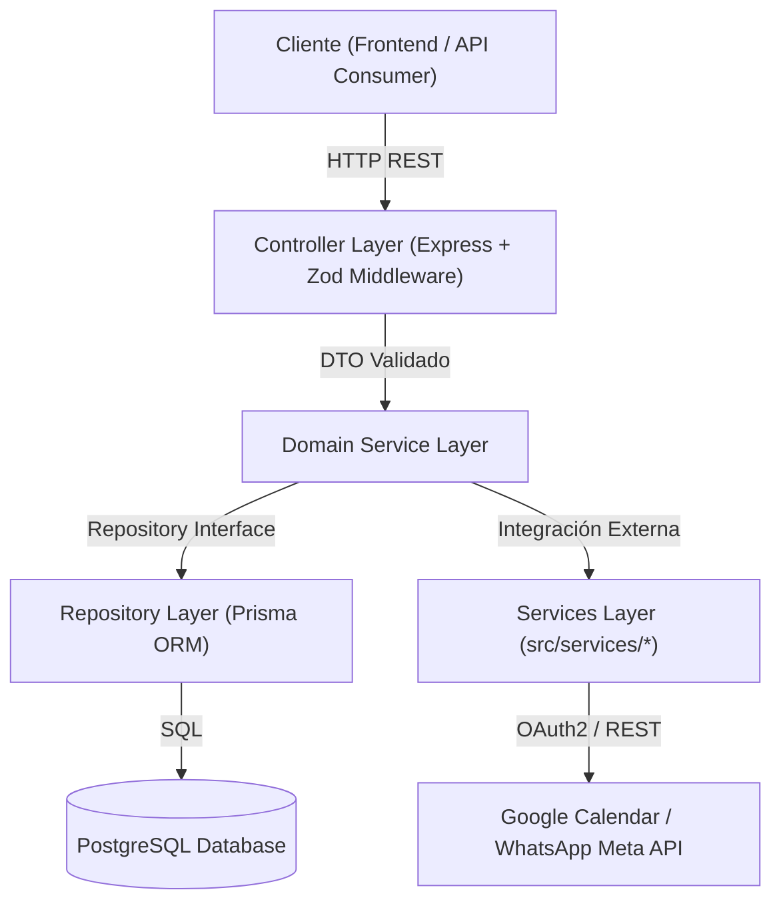

# Callvu Agenda API — Backend REST Service

> Servicio Backend autónomo para el motor de gestión de turnos e integración con agendas inteligentes.

---

## 1. Visión y Arquitectura

El **Callvu Agenda API** es el servicio central de lógica de negocio encuadrado en una **arquitectura modular de 3 capas** (Controller / Service / Repository) complementada con una **capa de Servicios Externos**:

- **Controller**: Maneja peticiones HTTP y valida la entrada de datos en tiempo de ejecución con **Zod**.
- **Service**: Concentra la lógica del dominio (reglas de atención, validaciones de slots, reservas). Desarrollado obligatoriamente mediante **Test-Driven Development (TDD)**.
- **Repository**: Capa de abstracción de datos (`IAgendaRepository`, etc.) desacoplada de la infraestructura, implementada con **Prisma ORM** y **PostgreSQL**.
- **Services (Integraciones)**: Capa independiente (`src/services/`) para conectores externos como **Google Calendar API v3** y **WhatsApp Business API (Meta Cloud API)**.



---

## 2. Tech Stack

| Capa | Tecnología | Propósito |
|------|-----------|-----------|
| Runtime | Node.js (v20+ LTS) | Entorno de ejecución de JS/TS |
| Lenguaje | TypeScript (v5.4+) | Tipado estático estricto |
| Web Framework | Express (v4) | Servidor HTTP REST |
| Validación | Zod | Esquemas de validación de DTOs en runtime |
| ORM | Prisma ORM (v5.14+) | Modelado y persistencia en PostgreSQL |
| Base de Datos | PostgreSQL (Docker Compose) | Contenedor local con `postgres:16-alpine` |
| Documentación | Swagger UI (`swagger-ui-express`) | UI interactiva para OpenAPI 3.0 en `/docs` |
| Servicios Externos | `googleapis` & Meta Cloud API | Integración con Google Calendar API v3 y WhatsApp Business API |
| Testing | Vitest + Supertest | Suite de pruebas unitarias e integración con TDD (39 tests) |

---

## 3. Estructura del Proyecto

```text
callvu-agenda-api/
├── prisma/
│   └── schema.prisma                # Esquema declarativo de base de datos PostgreSQL
├── src/
│   ├── modules/                     # Módulos del Dominio de Negocio
│   │   ├── agenda/                  # Módulo de Agendas y Horarios de Atención
│   │   ├── cliente/                 # Módulo de Clientes (Directorio y WhatsApp)
│   │   ├── slot/                    # Algoritmo dinámico de cálculo de disponibilidad
│   │   └── turno/                   # Módulo de Turnos y Gestión de Reservas
│   ├── services/                    # Capa de Servicios e Integraciones Externas
│   │   ├── calendar/                # Conector Google Calendar API (v3)
│   │   └── whatsapp/                # Conector WhatsApp Business API (Webhooks & Messaging)
│   ├── shared/                      # Infraestructura, Middlewares y Swagger
│   ├── config/                      # Configuración de entorno con Zod (.env)
│   ├── types/                       # Interfaces y tipos de dominio
│   ├── app.ts                       # Entrada de Express e Inyección de Dependencias
│   └── server.ts                    # Punto de entrada HTTP (Puerto 3000)
├── docker-compose.yml               # Orquestación del contenedor PostgreSQL local
├── MANUAL_TESTING_GUIDE.md          # Guía paso a paso con objetos JSON de prueba y diagramas
├── openspec/                        # Especificaciones y requerimientos (SDD)
├── ARCHITECTURE.md                  # Detalles arquitectónicos del backend
├── package.json
├── tsconfig.json
└── vitest.config.ts
```

---

## 4. Guía de Inicio Rápido (Local Setup)

### Requisitos Previos
- Node.js v20+ y pnpm (`npm i -g pnpm`)
- Docker Desktop activo

### Pasos de Inicio

```bash
# 1. Instalar dependencias
pnpm install

# 2. Copiar variables de entorno
cp .env.example .env

# 3. Levantar contenedor de PostgreSQL
docker compose up -d

# 4. Generar cliente y aplicar migraciones de Prisma
pnpm prisma:generate
pnpm prisma:migrate

# 5. Ejecutar suite de pruebas TDD
pnpm test

# 6. Iniciar servidor en desarrollo
pnpm dev
```

- **Servidor HTTP**: `http://localhost:3000`
- **Swagger Documentation UI**: `http://localhost:3000/docs`

---

## 5. Guía de Prueba Manual & Integración con WhatsApp

Para consultar el **diagrama de flujo de secuencia**, obtener los **objetos JSON y comandos cURL de prueba** (Crear Agenda, Cliente, Slots y Turnos) y seguir la **guía paso a paso para vincular WhatsApp Cloud API con Ngrok**:

👉 **[MANUAL_TESTING_GUIDE.md](file:///C:/Users/moca_/OneDrive/Escritorio/Callvu_Agenda/MANUAL_TESTING_GUIDE.md)**
